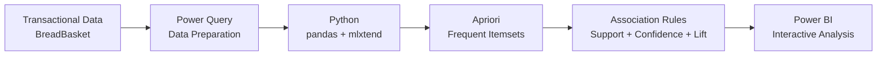

<div align="center">

<h1>Market Basket Analysis with Power BI</h1>

<h3>Association rule mining with Python, Apriori and interactive Power BI analytics.</h3>


Developed by [Rui Ribeiro](https://github.com/ruialexrib)

</div>

---

## About

**Market Basket Analysis with Power BI** demonstrates how association rule mining can be integrated directly into a Business Intelligence workflow using **Power BI**, **Power Query** and **Python**.

The project analyses transactional purchase data from the BreadBasket dataset and applies the **Apriori algorithm** to discover relationships between products that frequently occur together in the same transactions.

Python performs the data preparation and association rule mining during the Power Query refresh process. The resulting rules are returned to Power BI as a structured analytical dataset that can be explored through interactive visualisations.

## Project Objectives

The project demonstrates how to:

- Prepare transactional data for market basket analysis
- Transform purchase records into transaction baskets
- Generate frequent itemsets using the Apriori algorithm
- Derive association rules from frequent itemsets
- Evaluate rules using support, confidence and lift
- Integrate Python scripts into Power Query
- Return machine learning results directly to the Power BI data model
- Explore product associations through interactive Power BI reports

## Architecture



The analytical workflow is executed as part of the Power BI data refresh process:

```text
Transactional Data
        │
        ▼
   Power Query
        │
        ▼
      Python
        │
        ▼
 Apriori Algorithm
        │
        ▼
 Association Rules
        │
        ▼
     Power BI
```

## Market Basket Analysis

Market Basket Analysis is a data mining technique used to identify products or items that tend to occur together within transactions.

A typical association rule has the form:

```text
{Coffee} → {Bread}
```

This indicates an association between transactions containing **Coffee** and transactions that also contain **Bread**. The strength and relevance of each rule are evaluated using several metrics.

## Association Rule Metrics

| Metric | Description |
| --- | --- |
| **Support** | Frequency with which an itemset occurs in the transaction dataset |
| **Confidence** | Probability of observing the consequent when the antecedent is present |
| **Lift** | Strength of the association compared with the items occurring independently |
| **Leverage** | Difference between the observed co-occurrence and the expected independent co-occurrence |
| **Conviction** | Measure of the implication strength of the rule |

A lift greater than `1` indicates that the antecedent and consequent occur together more frequently than would be expected if they were independent.

## Analysis Workflow

The analysis follows these main steps:

1. Load and validate the transactional dataset
2. Clean and standardise product names
3. Group products by transaction
4. Transform transactions into a basket matrix
5. Apply one-hot encoding
6. Generate frequent itemsets using Apriori
7. Derive association rules
8. Calculate association metrics
9. Filter and rank the resulting rules
10. Return the analytical dataset to Power BI

## Technology Stack

| Technology | Role |
| --- | --- |
| **Power BI Desktop** | Interactive reporting and visual analysis |
| **Power Query** | Data preparation and Python execution |
| **Python** | Data processing and association rule mining |
| **pandas** | Transactional data manipulation |
| **mlxtend** | Apriori algorithm and association rule generation |
| **Jupyter Notebook** | Development and validation of the analytical workflow |

## Repository Structure

```text
powerbi-market-basket-analysis/
├── src/
│   ├── Market_Basket_Analysis_Dashboard.pbix
│   ├── Market_Basket_Analysis_Notebook.ipynb
│   ├── breadbasket.csv
│   └── requirements.txt
├── LICENSE
└── readme.md
```

### Project Files

- **`Market_Basket_Analysis_Dashboard.pbix`** — Power BI report containing the complete analytical workflow and interactive visualisations.
- **`Market_Basket_Analysis_Notebook.ipynb`** — Jupyter Notebook used to develop and validate the Apriori analysis independently of Power BI.
- **`breadbasket.csv`** — Transactional dataset used for the market basket analysis.
- **`requirements.txt`** — Python dependencies required by the project.

## Requirements

The Python analysis requires:

```text
pandas>=1.5.0
mlxtend>=0.23.0
```

Install the dependencies with:

```bash
pip install -r src/requirements.txt
```

A local installation of **Power BI Desktop** with Python scripting configured is required to execute the analysis inside Power Query.

## Running the Demo

### Jupyter Notebook

The analytical workflow can be explored independently from Power BI using:

```text
src/Market_Basket_Analysis_Notebook.ipynb
```

This is useful for understanding, testing and adjusting the Apriori parameters before integrating the analysis into Power BI.

### Power BI

Open:

```text
src/Market_Basket_Analysis_Dashboard.pbix
```

Refresh the report to execute the Power Query transformation and Python-based association rule analysis.

## Output

The association rule dataset returned to Power BI includes:

- Antecedents
- Consequents
- Support
- Confidence
- Lift
- Leverage
- Conviction

These fields can be used to rank, filter and explore the strongest product associations interactively.

## Configuration

The results depend on parameters such as the minimum support and rule-generation thresholds configured in the Python analysis.

Lower thresholds can generate a larger number of rules, while higher thresholds focus the analysis on more frequent or stronger associations. Parameter selection should therefore reflect the size and characteristics of the transactional dataset and the analytical objective.

## Educational Scope

This repository is intended as an educational and demonstration project showing how data mining techniques can be incorporated into a Power BI workflow.

For larger or production workloads, the computational cost of association rule mining and the execution of Python during Power BI refresh should be evaluated carefully. Depending on data volume and deployment requirements, moving the analytical processing outside Power BI may provide better scalability and operational control.

## License

Distributed under the [MIT License](LICENSE).

Copyright © 2025 [Rui Ribeiro](https://github.com/ruialexrib).
